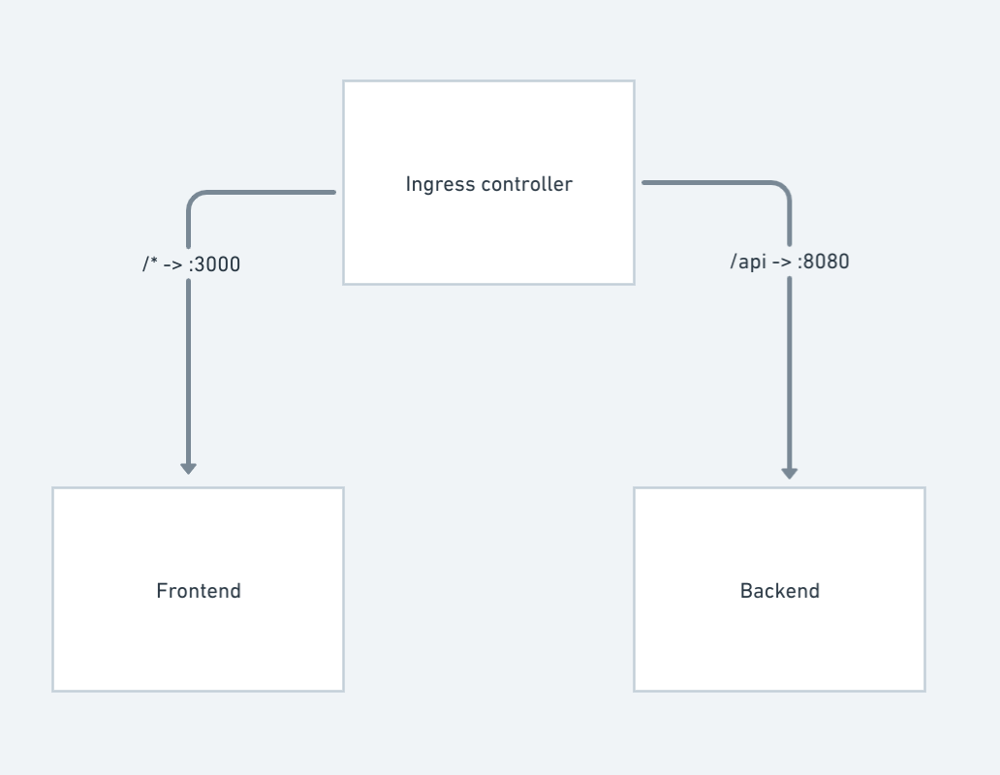
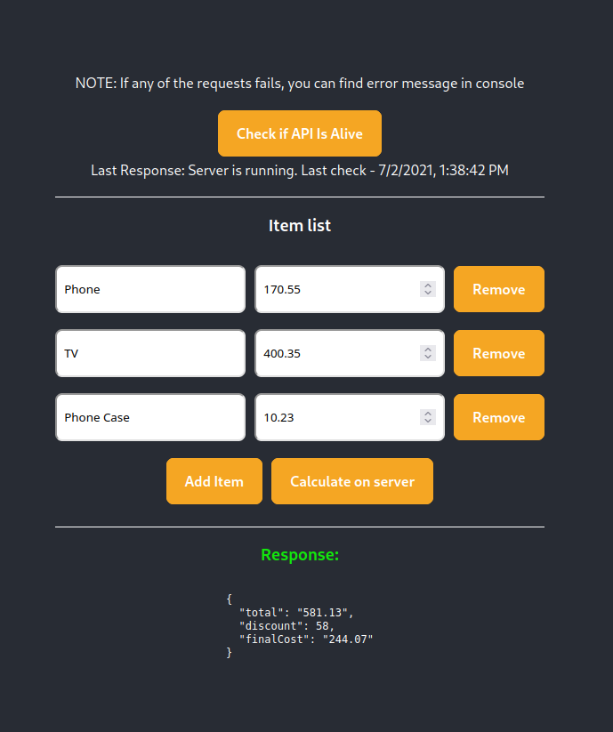

# The task
* In this task you will need to spin up front-end & backend apps in kubernetes. Both apps are stateless, you don't need to worry about persistent storage.
* To get k8s (kubernetes) cluster you can use https://github.com/kubernetes/minikube; https://github.com/ubuntu/microk8s; or any other way to get your hands on k8s cluster.
* Front-end & back-end apps cannot run in the same pod.
* You will have to share your files that were needed to spin these apps on the k8s cluster (helm charts or ingress/deployment/... yaml files) and a readme how to use your files. Having your shared files and readme we should be able to spin these apps on our cluster.

## Docker images
* front-end -> `igeolise/k8s-task-frontend:1.0.0`
* back-end  -> `igeolise/k8s-task-backend:1.0.0`

## Building docker images locally
If you want to check source code of the images and build them yourself you can do this with:
* run `DOCKER_BUILDKIT=1 docker build -t igeolise/k8s-task-backend:1.0.0 -f ./docker/back/Dockerfile .` to build back-end
* run `DOCKER_BUILDKIT=1 docker build -t igeolise/k8s-task-frontend:1.0.0 -f ./docker/front/Dockerfile .` to build front-end

## Diagram

### Working app
This is what you should see if you spin up apps successfully
